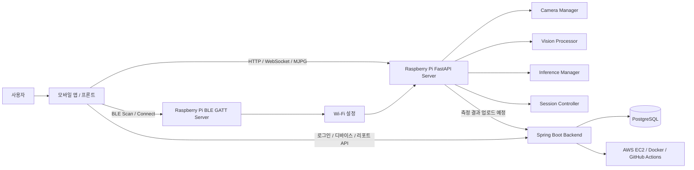

# Vision Pose Coach 팀원 설명자료 — 최신화본

> 기준 버전: `WorkSpace(13).zip`  
> 목적: 팀원이 현재 프로젝트 구조, Raspberry Pi 서버 역할, BLE/Wi-Fi 연동 방식, 프론트 연동 스펙, 남은 검증 작업을 한 번에 이해할 수 있도록 정리한 문서입니다.

---

## 0. 한 줄 요약

**Vision Pose Coach는 Raspberry Pi 카메라 기기가 사용자의 자세와 졸음 상태를 측정하고, 모바일 앱이 기기 연결·측정 제어·리포트 확인을 담당하며, Spring Boot 백엔드가 사용자/디바이스/측정 데이터를 관리하는 자세 습관 개선 플랫폼입니다.**

이 프로젝트의 핵심은 단순히 “자세가 나쁘다”를 한 번 알려주는 것이 아닙니다. 사용자가 장시간 컴퓨터 작업 중 무의식적으로 반복하는 나쁜 자세와 피로 상태를 측정하고, 기록과 피드백을 통해 장기적으로 바른 작업 습관을 만들도록 돕는 것입니다.

현재 `WorkSpace(13)` 기준으로는 **Raspberry Pi FastAPI 서버 쪽의 Wi-Fi/BLE 프로비저닝 구조가 구현된 상태**입니다. 단, 실제 Raspberry Pi 하드웨어에서 BLE 광고·연결·Wi-Fi 연결까지 검증하는 통합 테스트는 아직 필요합니다.

---

## 1. 프로젝트를 왜 만드는가

### 1.1 문제 상황

온라인 학습, 개발, 사무 업무, 재택근무처럼 오래 앉아서 화면을 보는 시간이 늘어나면서 다음 문제가 반복됩니다.

- 목이 앞으로 나오는 거북목 자세
- 턱을 괴는 습관
- 몸이 한쪽으로 기울어지는 비대칭 자세
- 장시간 화면 응시로 인한 피로 누적
- 피로 누적 후 졸음 발생
- 집중력 저하와 작업 효율 저하

사용자는 본인이 언제 자세가 무너지는지 잘 모르는 경우가 많습니다. 또 단순 알림을 한두 번 받는다고 습관이 바로 바뀌지도 않습니다.

그래서 프로젝트 방향은 다음과 같습니다.

> 사용자를 강제로 교정하는 것이 아니라, **측정 → 기록 → 피드백 → 목표 관리 → 반복 사용**을 통해 자세 습관을 개선하게 만든다.

---

## 2. 우리가 생각한 제품 방향

### 2.1 기존 구조와 한계

초기 실험 구조는 Raspberry Pi에서 PyQt 화면으로 실시간 측정을 보여주고, Streamlit 웹 리포트로 결과를 확인하는 방식이었습니다.

```text
기존 실험 구조
Raspberry Pi PyQt 측정 앱
+ Streamlit 리포트
```

이 구조는 실험과 데모에는 좋지만, 제품 관점에서는 한계가 있습니다.

- 사용자가 Raspberry Pi 화면을 직접 봐야 함
- 리포트 접근성이 낮음
- 앱 기반 목표/루틴/알림 기능을 붙이기 어려움
- 사용자 계정별 기록 관리가 어려움
- 기기 등록, 네트워크 설정, 측정 제어 흐름이 자연스럽지 않음

그래서 최종 목표는 다음 구조입니다.

```text
확장 목표 구조
Flutter 또는 별도 프론트 모바일 앱
+ Raspberry Pi FastAPI 측정 서버
+ Spring Boot 백엔드
+ PostgreSQL DB
+ 클라우드 배포
```

### 2.2 최종 사용자 흐름

사용자 입장에서의 최종 흐름은 다음과 같습니다.

```text
1. 앱 실행
2. 로그인/회원가입
3. 내 Raspberry Pi 기기 추가
4. 앱에서 BLE로 기기 검색
5. BLE로 Raspberry Pi에 Wi-Fi 정보 전달
6. Raspberry Pi가 Wi-Fi에 연결
7. 앱에서 기기 온라인 상태 확인
8. 측정 시간/목표 선택
9. 측정 시작
10. Raspberry Pi가 자세/졸음 상태 측정
11. 앱에서 실시간 상태 확인
12. 측정 종료
13. 측정 결과 기반 리포트 확인
14. 목표/루틴/통계로 장기 습관 관리
```

여기서 중요한 점은 다음입니다.

> **BLE는 처음 Wi-Fi 설정용이고, 실제 측정 데이터 통신은 Wi-Fi 기반 HTTP/WebSocket/MJPG로 한다.**

BLE를 계속 연결해서 측정 데이터를 주고받는 구조가 아닙니다. BLE는 초기 연결과 Wi-Fi 설정을 위한 통로입니다.

---

## 3. 전체 아키텍처

### 3.1 목표 아키텍처



### 3.2 구성요소별 역할

| 구성요소 | 역할 |
|---|---|
| 모바일 앱 / 프론트 | 사용자 화면, 로그인, 기기 등록, BLE 연결, Wi-Fi 설정 전달, 측정 시작/종료, 리포트 확인 |
| Raspberry Pi FastAPI 서버 | 카메라 제어, 실시간 자세/졸음 측정, WebSocket 상태 전송, MJPG 스트리밍, Wi-Fi 상태/API 제공 |
| Raspberry Pi BLE GATT 서버 | 앱이 Raspberry Pi를 찾아 Wi-Fi 정보를 전달하는 실제 BLE 서버 |
| Wi-Fi Manager | `dry_run`, `mock`, `real` 모드로 Wi-Fi 스캔/연결/상태 확인 처리 |
| Spring Boot 백엔드 | 사용자 계정, 디바이스 등록, 측정 세션, 측정 결과, 리포트 데이터 관리 |
| PostgreSQL | 사용자/디바이스/측정/리포트 데이터 저장 |
| AWS EC2 / Docker / GitHub Actions | 백엔드 배포 및 운영 자동화 |

---

## 4. `WorkSpace(13)` 기준 현재 코드 상태

이번 ZIP은 **Raspberry Pi FastAPI 서버와 기기 연동 코드가 중심**입니다. 프론트 앱 프로젝트와 Spring Boot 백엔드 전체 코드는 이 ZIP에 포함되어 있지 않습니다.

### 4.1 주요 파일 구조

```text
WorkSpace/
├── server_main.py
├── SERVER_README.md
├── APP_API_SPEC.md
├── BLE_GATT_SPEC.md
├── requirements-server.txt
│
├── network/
│   ├── api_server.py
│   ├── wifi_manager.py
│   ├── ble_provisioning_manager.py
│   ├── ble_gatt_server.py
│   └── mjpg_streamer.py
│
├── camera/
│   ├── camera_manager.py
│   └── vision_processor.py
│
├── core/
│   ├── app_state.py
│   ├── session_controller.py
│   ├── calibration_manager.py
│   ├── inference_manager.py
│   └── session_logger.py
│
├── modules/
│   ├── features.py
│   ├── TFLiteEngine.py
│   ├── visualizer.py
│   └── ...
│
├── pyQt/
│   └── 기존 PyQt 실시간 측정 앱 관련 코드
│
├── streamlit/
│   └── 기존 Streamlit 리포트 관련 코드
│
├── docs/
│   └── FLUTTER_BLE_INTEGRATION.md
│
├── tests/
│   ├── test_wifi_manager.py
│   ├── test_ble_provisioning_manager.py
│   ├── test_ble_gatt_server.py
│   ├── test_app_api_spec.py
│   └── ...
│
└── tools/
    ├── verify_real_wifi.py
    └── run_ble_gatt_server.py
```

### 4.2 테스트 결과

`WorkSpace(13)` 기준 테스트 결과는 다음입니다.

```text
36 passed
```

현재 작성된 단위 테스트 기준으로는 Wi-Fi Manager, BLE Provisioning Manager, BLE GATT Server import/상태 처리, API 스펙 문서 계약 테스트가 통과한 상태입니다.

단, 이 테스트는 실제 Raspberry Pi 하드웨어의 Bluetooth 광고/연결을 검증하는 것은 아닙니다. 실제 BLE는 반드시 Raspberry Pi와 스마트폰 앱에서 통합 테스트해야 합니다.

---

## 5. 현재 완료된 범위와 아직 남은 범위

### 5.1 완료에 가까운 범위

서버 코드 개발 관점에서는 아래 항목이 준비되었습니다.

- FastAPI 서버 기본 구조
- 세션 상태 API
- WebSocket 측정 제어 구조
- MJPG 스트리밍 엔드포인트
- Wi-Fi Manager 구조
- `dry_run`, `mock`, `real` Wi-Fi 모드
- `real` 모드의 `nmcli` 기반 Wi-Fi scan/connect/status 코드
- HTTP mock BLE provisioning API
- 실제 BLE GATT 서버 코드
- BLE UUID / payload / status 스펙 문서화
- 프론트 팀 전달용 BLE 연동 문서
- Raspberry Pi 실기기 Wi-Fi 검증용 스크립트

### 5.2 아직 남은 범위

제품 완성 관점에서는 아래 항목이 남아 있습니다.

- 실제 Raspberry Pi에서 BLE advertising 확인
- 스마트폰에서 `VisionPoseCoach-Pi` 검색 확인
- 프론트 앱에서 BLE connect/discover/read/write/notify 확인
- BLE로 보낸 SSID/password가 실제 `WiFiManager.configure_wifi()`까지 전달되는지 확인
- `VPC_WIFI_MODE=real`에서 실제 Wi-Fi 연결 확인
- Wi-Fi 연결 후 `/network/status` 또는 `/health` 호출 확인
- 이후 측정 WebSocket/MJPG/HTTP 흐름 통합 확인
- Spring Boot 백엔드와 측정 결과 업로드/저장 연동
- 프론트 화면과 전체 사용자 플로우 연동

---

## 6. Wi-Fi 연동 구조

### 6.1 Wi-Fi Manager 위치

현재 서버가 사용하는 Wi-Fi 코드는 다음입니다.

```text
network/wifi_manager.py
```

루트에 있는 아래 파일은 현재 서버에서 사용하는 파일이 아닙니다.

```text
wifi_manager.py
```

이 파일은 legacy/experimental 파일로 볼 수 있으며, 현재 FastAPI 서버 연동 경로에서는 `network/wifi_manager.py`를 기준으로 봐야 합니다.

### 6.2 Wi-Fi 모드

Wi-Fi 동작 모드는 환경변수 `VPC_WIFI_MODE`로 선택합니다. 기본값은 안전하게 `dry_run`입니다.

```bash
VPC_WIFI_MODE=dry_run
VPC_WIFI_MODE=mock
VPC_WIFI_MODE=real
```

| 모드 | 의미 | 사용 상황 |
|---|---|---|
| `dry_run` | 실제 OS Wi-Fi를 건드리지 않고 요청 검증/상태 저장만 수행 | 기본 안전 모드, 개발 초기 |
| `mock` | 가짜 Wi-Fi 목록과 가짜 연결 성공 응답 제공 | 프론트 UI 개발, 데모 |
| `real` | Raspberry Pi OS에서 `nmcli`로 실제 Wi-Fi 스캔/연결/상태 확인 | 실제 Raspberry Pi 테스트 |

### 6.3 real 모드에서 사용하는 명령

`real` 모드에서는 `nmcli` 기반으로 실제 Wi-Fi를 다룹니다. 코드에서는 `shell=True`를 사용하지 않는 구조로 되어 있습니다.

```bash
nmcli -t -f SSID,SIGNAL,SECURITY device wifi list --rescan yes
nmcli device wifi connect "<SSID>" password "<PASSWORD>"
nmcli -t -f ACTIVE,SSID dev wifi
hostname -I
```

주의할 점은 다음입니다.

- password는 API 응답, 로그, status payload에 포함하지 않아야 함
- `real` 모드는 실제 Pi의 Wi-Fi 연결 상태를 바꿀 수 있음
- `nmcli`가 없는 환경에서는 실패할 수 있음
- Raspberry Pi OS에서 NetworkManager가 활성화되어 있어야 함

---

## 7. BLE 연동 구조

### 7.1 BLE의 역할

이 프로젝트에서 BLE는 **측정 데이터 통신용이 아닙니다.**

BLE의 역할은 다음 하나입니다.

```text
앱이 Raspberry Pi에게 Wi-Fi SSID/password를 전달하는 초기 설정 통로
```

Wi-Fi 연결이 끝나면 BLE는 끊어도 됩니다. 이후 실제 측정 통신은 Wi-Fi 기반으로 진행합니다.

```text
초기 설정
앱 → BLE → Raspberry Pi에 Wi-Fi 정보 전달

실제 서비스 사용
앱 ↔ Wi-Fi ↔ Raspberry Pi FastAPI Server
```

### 7.2 HTTP mock BLE와 실제 BLE GATT 서버의 차이

현재 프로젝트에는 BLE 관련 흐름이 두 종류 있습니다.

| 구분 | 위치 | 실제 BLE 여부 | 용도 |
|---|---|---|---|
| HTTP mock BLE API | `/provisioning/ble/*` | 아님 | BLE 하드웨어 없이 provisioning 흐름을 테스트하는 개발/디버그용 |
| 실제 BLE GATT 서버 | `network/ble_gatt_server.py`, `tools/run_ble_gatt_server.py` | 맞음 | Raspberry Pi를 BLE peripheral로 광고하고 GATT characteristic을 제공 |

중요한 점은 다음입니다.

> `/provisioning/ble/*`는 실제 블루투스가 아니다. 실제 BLE는 `tools/run_ble_gatt_server.py`로 별도 실행하는 GATT 서버다.

### 7.3 실제 BLE GATT 서버 파일

실제 BLE GATT 서버 구현은 다음 파일에 있습니다.

```text
network/ble_gatt_server.py
```

실행 스크립트는 다음입니다.

```text
tools/run_ble_gatt_server.py
```

실행 예시는 다음입니다.

```bash
VPC_WIFI_MODE=mock python tools/run_ble_gatt_server.py --debug
VPC_WIFI_MODE=real python tools/run_ble_gatt_server.py --debug
```

`mock` 모드는 실제 Wi-Fi 연결을 하지 않고 BLE 흐름을 확인할 때 유용합니다. `real` 모드는 실제 Wi-Fi 연결을 시도하므로 Raspberry Pi에서 주의해서 테스트해야 합니다.

---

## 8. BLE GATT 스펙

프론트 팀은 아래 스펙을 기준으로 앱에서 BLE 연동을 구현하면 됩니다.

### 8.1 Device Name

```text
VisionPoseCoach-Pi
```

### 8.2 UUID 목록

| 항목 | UUID | 속성 |
|---|---|---|
| Provisioning Service | `9f4c0001-7d9a-4b57-9d9f-000000000001` | Primary Service |
| Wi-Fi Configure Characteristic | `9f4c0002-7d9a-4b57-9d9f-000000000002` | Write |
| Status Characteristic | `9f4c0003-7d9a-4b57-9d9f-000000000003` | Read, Notify |
| Hello / Device Info Characteristic | `9f4c0004-7d9a-4b57-9d9f-000000000004` | Read only |

### 8.3 Hello / Device Info

Hello / Device Info characteristic은 **read only**입니다.

앱은 hello JSON을 write하지 않습니다. 앱은 이 characteristic을 read해서 이 기기가 `VisionPoseCoach-Pi`인지 확인합니다.

### 8.4 Wi-Fi Configure Payload

앱은 Wi-Fi Configure Characteristic에 아래 JSON을 UTF-8로 encode해서 write합니다.

```json
{
  "type": "configure_wifi",
  "client_id": "phone-001",
  "ssid": "MyWifi",
  "password": "my-password"
}
```

규칙은 다음입니다.

- `type`은 반드시 `configure_wifi`
- `ssid`는 필수
- `password`는 일반 보안 Wi-Fi에서는 필요
- 현재는 512 bytes 이하의 단일 JSON write 기준
- 가능하면 write with response 사용
- password는 응답/status/log/error에 절대 포함하지 않음

### 8.5 Status Payload

Status Characteristic read/notify 응답 예시는 다음입니다.

```json
{
  "mode": "real_ble",
  "device_name": "VisionPoseCoach-Pi",
  "state": "WIFI_CONNECTED",
  "wifi_connected": true,
  "ssid": "MyWifi",
  "last_error": null
}
```

가능한 state 값은 다음입니다.

```text
IDLE
ADVERTISING
CONNECTED
WIFI_CONFIGURING
WIFI_CONNECTED
FAILED
```

주의할 점은 다음입니다.

- password는 절대 포함하지 않음
- 실패 시에도 `last_error`에 password가 들어가면 안 됨
- `CONNECTED` 상태는 실제 BLE 연결 이벤트를 완벽하게 의미하지 않을 수 있음
- 제품 흐름에서 중요한 상태는 `WIFI_CONFIGURING`, `WIFI_CONNECTED`, `FAILED`

---

## 9. 프론트 앱 연동 흐름

프론트 팀은 아래 순서로 BLE provisioning을 구현하면 됩니다.

```text
1. BLE scan 시작
2. Device Name이 VisionPoseCoach-Pi이거나 Service UUID가 일치하는 기기 찾기
3. BLE connect
4. GATT service discover
5. Hello / Device Info characteristic read
6. Status characteristic read 또는 notify 구독
7. Wi-Fi Configure characteristic에 JSON write
8. Status가 WIFI_CONFIGURING → WIFI_CONNECTED 또는 FAILED로 바뀌는지 확인
9. WIFI_CONNECTED면 BLE disconnect
10. 이후 Wi-Fi 기반 HTTP/WebSocket/MJPG 통신으로 전환
```

프론트 팀에 전달할 문서는 다음 파일입니다.

```text
docs/FLUTTER_BLE_INTEGRATION.md
```

파일명은 Flutter라고 되어 있지만, 핵심은 프론트 앱이 따라야 하는 BLE contract입니다. 실제 프론트가 Flutter가 아니더라도 Device Name, UUID, payload, status 흐름은 동일하게 사용할 수 있습니다.

---

## 10. FastAPI 서버 API 요약

### 10.1 서버 실행

```bash
cd /home/pi/VisionPoseCoach/WorkSpace
python server_main.py
```

Wi-Fi mode를 지정하려면 다음처럼 실행합니다.

```bash
VPC_WIFI_MODE=mock python server_main.py
VPC_WIFI_MODE=real python server_main.py
```

### 10.2 주요 HTTP Endpoint

| Method | Endpoint | 역할 |
|---|---|---|
| GET | `/health` | 서버 상태, 카메라 상태, 앱 상태 확인 |
| GET | `/mjpg` | MJPG 카메라 프리뷰 스트림 |
| GET | `/session/status` | 현재 측정 세션 상태 조회 |
| GET | `/session/latest-report` | 최신 측정 리포트 조회 |
| GET | `/session/report/{session_id}` | 특정 세션 리포트 조회 |
| GET | `/network/status` | 현재 Wi-Fi/네트워크 상태 조회 |
| GET | `/network/wifi/scan` | Wi-Fi 목록 조회 |
| POST | `/network/wifi/configure` | Wi-Fi 설정 요청 |
| POST | `/network/wifi/forget` | 저장된 Wi-Fi 설정 상태 초기화 |
| GET | `/provisioning/ble/status` | HTTP mock BLE provisioning 상태 조회 |
| GET | `/provisioning/status` | 앱용 통합 기기 등록 상태 조회 |
| POST | `/provisioning/ble/start` | HTTP mock advertising 상태 시작 |
| POST | `/provisioning/ble/stop` | HTTP mock advertising 상태 중지 |
| POST | `/provisioning/ble/message` | HTTP mock BLE message 처리 |
| POST | `/provisioning/ble/reset` | HTTP mock BLE 상태 초기화 |
| WS | `/ws` | 측정 시작/종료 및 실시간 세션 메시지 |

### 10.3 Wi-Fi API 예시

상태 확인:

```bash
curl http://localhost:8000/network/status
```

Wi-Fi 목록 조회:

```bash
curl http://localhost:8000/network/wifi/scan
```

Wi-Fi 설정:

```bash
curl -X POST http://localhost:8000/network/wifi/configure \
  -H "Content-Type: application/json" \
  -d '{"ssid":"MyWifi","password":"my-password"}'
```

응답에는 password가 포함되지 않아야 합니다.

---

## 11. 측정 세션과 실시간 통신

### 11.1 WebSocket 역할

측정 시작/종료와 실시간 상태 전송은 WebSocket `/ws`를 사용합니다.

예시 command:

```json
{"command": "start_session"}
```

```json
{"command": "stop_session"}
```

측정 중에는 세션 상태, 자세 라벨, 졸음 라벨, 검출 여부 등을 앱으로 보낼 수 있습니다.

### 11.2 `/session/status`의 역할

앱이 재실행되거나 네트워크가 끊겼다가 다시 연결되면 현재 측정 세션 상태를 복구해야 합니다. 이때 `/session/status`를 사용합니다.

예시:

```json
{
  "type": "session_status",
  "session_id": "2026-06-25_102030",
  "is_running": true,
  "state": "MEASURING",
  "message": "측정 중입니다.",
  "screen_hint": "MEASUREMENT",
  "elapsed_sec": 120,
  "duration_sec": 1800,
  "remain_sec": 1680,
  "latest_result": {
    "posture_label": "Forward Head",
    "posture_confidence": 0.82,
    "fatigue_label": "Normal",
    "fatigue_probability": 0.21,
    "pose_detected": true,
    "face_detected": true,
    "error": null
  }
}
```

프론트 앱은 `screen_hint`를 보고 어느 화면으로 복구할지 판단할 수 있습니다.

---

## 12. 실제 Raspberry Pi 테스트 체크리스트

서버 코드가 준비되어 있어도 실제 BLE와 Wi-Fi는 Raspberry Pi 환경에서만 검증할 수 있습니다.

### 12.1 기본 상태 확인

```bash
sudo systemctl status bluetooth
bluetoothctl show
rfkill list
nmcli device status
python -c "import dbus_next; print('dbus-next ok')"
```

### 12.2 Wi-Fi real 모드 검증

연결 없이 상태와 주변 Wi-Fi만 확인:

```bash
python tools/verify_real_wifi.py
```

실제 연결 시도:

```bash
python tools/verify_real_wifi.py --connect --ssid "MyWifi" --password "my-password"
```

이 스크립트는 password를 출력하지 않아야 합니다.

### 12.3 BLE GATT 서버 실행

Wi-Fi 연결을 mock으로 두고 BLE 흐름 확인:

```bash
VPC_WIFI_MODE=mock python tools/run_ble_gatt_server.py --debug
```

실제 Wi-Fi 연결까지 시도:

```bash
VPC_WIFI_MODE=real python tools/run_ble_gatt_server.py --debug
```

### 12.4 문제 발생 시 확인할 것

- 스마트폰에서 `VisionPoseCoach-Pi`가 안 보이면 `bluetooth.service` 확인
- `rfkill`로 Bluetooth가 block 되었는지 확인
- BlueZ/D-Bus 권한 문제 확인
- GATT registration 실패 여부 확인
- advertising registration 실패 여부 확인
- Wi-Fi 연결 실패 시 `nmcli device wifi list`로 SSID가 보이는지 확인
- `VPC_WIFI_MODE=real`은 실제 Wi-Fi 연결을 변경하므로 테스트 환경 주의

---

## 13. 보안상 중요한 규칙

Wi-Fi password는 다음 위치에 절대 노출되면 안 됩니다.

- API 응답
- BLE Status payload
- 로그
- 예외 메시지
- 디버그 출력
- 테스트 출력
- 프론트 화면의 상태 메시지

현재 구조에서도 이 원칙을 지키는 방향으로 구현되어 있습니다. 앞으로 프론트 연동 시에도 configure payload 전체를 print하거나 error object 전체를 그대로 노출하면 안 됩니다.

---

## 14. 팀원별 역할 구분

### 14.1 Raspberry Pi 서버 담당

- `network/wifi_manager.py` 유지보수
- `network/ble_gatt_server.py` 유지보수
- `tools/run_ble_gatt_server.py` 실행/검증
- `tools/verify_real_wifi.py`로 Wi-Fi 검증
- FastAPI `/network/*`, `/session/*`, `/ws`, `/mjpg` API 유지
- 실제 Pi 하드웨어 통합 테스트

### 14.2 프론트 앱 담당

- BLE scan/connect/discover 구현
- Hello characteristic read
- Status characteristic read/notify 구독
- Wi-Fi Configure characteristic write
- `WIFI_CONNECTED` 또는 `FAILED` 상태 처리
- Wi-Fi 연결 후 `/network/status` 또는 `/health` 호출
- 측정 시작/종료 화면, WebSocket, MJPG 프리뷰 연동

### 14.3 Spring Boot 백엔드 담당

- 사용자 인증/인가
- 디바이스 등록/관리
- 측정 세션 저장
- 측정 결과 저장
- 리포트 데이터 제공
- PostgreSQL 연동
- AWS/Docker/GitHub Actions 배포 흐름 관리

---

## 15. 현재 상태를 팀원에게 설명하는 말

팀원에게 짧게 설명하면 이렇게 말할 수 있습니다.

> 현재 Raspberry Pi 서버 쪽은 Wi-Fi/BLE provisioning 구조가 준비된 상태입니다.  
> Wi-Fi는 `dry_run`, `mock`, `real` 모드로 분리되어 있고, `real` 모드에서는 `nmcli`로 실제 Wi-Fi 스캔과 연결을 시도합니다.  
> BLE는 `/provisioning/ble/*` HTTP mock과 실제 `network/ble_gatt_server.py` GATT 서버가 분리되어 있습니다.  
> 프론트 앱은 `VisionPoseCoach-Pi`를 BLE로 찾고, 정해진 UUID의 Wi-Fi Configure characteristic에 SSID/password JSON을 write하면 됩니다.  
> 연결 성공 후에는 BLE가 아니라 Wi-Fi 기반 HTTP/WebSocket/MJPG로 측정 데이터를 주고받습니다.  
> 다만 실제 Raspberry Pi에서 BLE 광고, 스마트폰 연결, 실제 Wi-Fi 연결까지는 아직 하드웨어 통합 검증이 필요합니다.

---

## 16. 최종 판단

`WorkSpace(13)` 기준으로 서버/BLE-Wi-Fi 프로비저닝 개발은 **프론트 팀에게 스펙을 전달할 수 있는 단계**까지 왔습니다.

다만 “완성”이라는 표현은 범위를 나눠서 봐야 합니다.

```text
서버 코드 개발 관점
→ 거의 완료 단계

프론트 연동 관점
→ 프론트 팀이 BLE 스펙대로 구현해야 함

실제 제품 검증 관점
→ Raspberry Pi + 스마트폰 + 실제 Wi-Fi 환경에서 통합 테스트 필요

전체 프로젝트 관점
→ Spring Boot 백엔드, 앱 화면, 측정 리포트, 배포 연동까지 남아 있음
```

즉 현재 상태는 다음과 같이 정리할 수 있습니다.

> **Raspberry Pi 서버 쪽 BLE/Wi-Fi 연동 구조는 구현과 문서화가 상당히 진행되었고, 이제 실제 기기 검증과 프론트 앱 연동 단계로 넘어가면 된다.**

