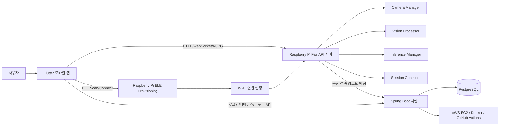
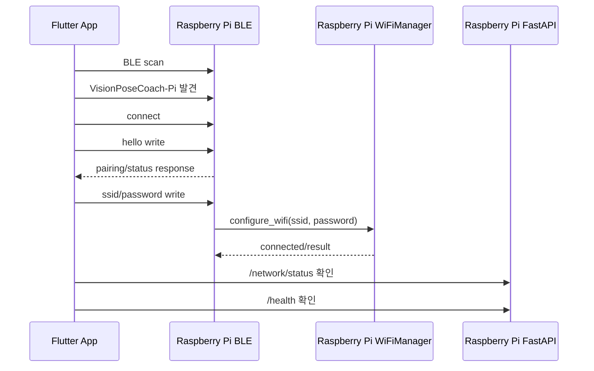

# Vision Pose Coach 프로젝트 팀원 설명자료

> 문서 목적: 팀원이 프로젝트의 전체 방향, 현재 코드 구조, BLE/Wi-Fi 연동 의도, Raspberry Pi 서버 역할, 앞으로 남은 작업을 한 번에 이해할 수 있도록 정리한 설명자료입니다.

---

## 0. 한 줄 요약

**Vision Pose Coach는 Raspberry Pi 카메라 기기가 사용자의 자세와 졸음 상태를 측정하고, Flutter 앱이 기기 연결·측정 제어·리포트 확인을 담당하며, Spring Boot 백엔드가 사용자/디바이스/측정 데이터를 관리하는 자세 습관 개선 플랫폼이다.**

단순히 “자세가 나쁘다”를 알려주는 앱이 아니라, 장시간 컴퓨터 작업 중 무의식적으로 무너지는 자세와 피로 상태를 기록하고, 사용자가 장기적으로 바른 작업 습관을 만들 수 있게 돕는 것이 핵심이다.

---

## 1. 왜 이 프로젝트를 만드는가

### 1.1 문제 상황

온라인 학습, 개발, 사무 업무, 재택근무처럼 오래 앉아서 화면을 보는 시간이 많아졌다. 처음에는 바른 자세로 앉아도 시간이 지나면 다음과 같은 문제가 반복된다.

- 목이 앞으로 나오는 거북목 자세
- 턱을 괴는 습관
- 몸이 한쪽으로 기울어지는 비대칭 자세
- 장시간 화면 응시로 인한 피로 누적
- 피로 누적 후 졸음 발생
- 집중력 저하와 작업 효율 저하

이 문제는 단순히 “한 번 자세를 고치는 것”으로 끝나지 않는다. 사용자는 본인이 언제 자세가 무너지는지 잘 모르는 경우가 많고, 하루 이틀 알림을 받는다고 습관이 바로 바뀌지도 않는다.

그래서 우리 프로젝트의 핵심 방향은 다음과 같다.

> 사용자를 즉시 강제로 교정하는 것이 아니라, 측정 → 기록 → 피드백 → 목표 관리 → 반복 사용을 통해 자세 습관을 개선하게 만든다.

---

## 2. 우리가 생각한 제품 방향

### 2.1 기존 PyQt/Streamlit 구조에서 앱 구조로 확장

초기에는 Raspberry Pi에서 PyQt 화면으로 실시간 측정을 보여주고, Streamlit 웹 리포트로 결과를 보는 구조였다.

하지만 최종 제품 형태를 생각하면 사용자가 계속 활용하기 어렵다.

- Raspberry Pi 화면을 직접 봐야 한다.
- 리포트 접근성이 떨어진다.
- 목표/루틴/알림 같은 앱 기반 기능을 붙이기 어렵다.
- 사용자 계정별 기록 관리가 어렵다.

그래서 구조를 다음처럼 바꾸기로 했다.

```text
기존 실험 구조
Raspberry Pi PyQt 측정 앱
+ Streamlit 리포트

확장 목표 구조
Flutter 모바일 앱
+ Raspberry Pi FastAPI 측정 서버
+ Spring Boot 백엔드
+ PostgreSQL DB
+ 클라우드 배포
```

### 2.2 최종 사용 흐름

사용자 관점의 최종 흐름은 다음과 같다.

```text
1. 앱 실행
2. 로그인/회원가입
3. 내 Raspberry Pi 기기 추가
4. 앱에서 BLE로 기기 검색
5. BLE로 Raspberry Pi에 Wi-Fi 정보 전달
6. Raspberry Pi가 Wi-Fi에 연결
7. 앱에서 기기 온라인 상태 확인
8. 측정 시간/목표 선택
9. 측정 시작
10. Raspberry Pi가 자세/졸음 상태 측정
11. 앱에서 실시간 상태 확인
12. 측정 종료
13. 서버에 저장된 측정 결과 기반으로 리포트 확인
14. 목표/루틴/통계로 장기 습관 관리
```

여기서 중요한 점은 **BLE는 처음 Wi-Fi 설정용**, **Wi-Fi는 실제 데이터 통신용**이라는 것이다.

---

## 3. 전체 아키텍처

### 3.1 최종 목표 아키텍처



### 3.2 각 구성요소의 역할

| 구성요소 | 역할 |
|---|---|
| Flutter 앱 | 사용자 화면, 로그인, 기기 등록, BLE 연결, Wi-Fi 설정 전달, 측정 시작/종료, 리포트 확인 |
| Raspberry Pi FastAPI 서버 | 카메라 제어, 실시간 자세/졸음 측정, WebSocket 상태 전송, MJPG 스트리밍, Wi-Fi 설정 처리 |
| BLE Provisioning | 앱이 Raspberry Pi를 찾아서 Wi-Fi 정보를 전달하는 초기 연결 통로 |
| Wi-Fi | BLE 이후 실제 HTTP/WebSocket 통신을 위한 네트워크 |
| Spring Boot 백엔드 | 사용자 계정, 디바이스 등록, 측정 세션, 측정 결과, 리포트 데이터 관리 |
| PostgreSQL | 사용자/디바이스/측정/리포트 데이터 저장 |
| AWS EC2 / Docker / GitHub Actions | 백엔드 배포 및 운영 자동화 |

---

## 4. 현재 업로드된 `WorkSpace(10)` 기준 실제 코드 상태

이번 ZIP은 **Raspberry Pi FastAPI 서버 쪽 코드가 중심**이다. Flutter 앱과 Spring Boot 백엔드 전체 코드는 이 ZIP 안에는 포함되어 있지 않다.

### 4.1 주요 폴더 구조

```text
WorkSpace/
├── server_main.py
├── SERVER_README.md
├── APP_API_SPEC.md
├── BLE_GATT_SPEC.md
├── requirements-server.txt
│
├── network/
│   ├── api_server.py
│   ├── wifi_manager.py
│   ├── ble_provisioning_manager.py
│   └── mjpg_streamer.py
│
├── camera/
│   ├── camera_manager.py
│   └── vision_processor.py
│
├── core/
│   ├── app_state.py
│   ├── session_controller.py
│   ├── calibration_manager.py
│   ├── inference_manager.py
│   └── session_logger.py
│
├── modules/
│   ├── features.py
│   ├── TFLiteEngine.py
│   ├── visualizer.py
│   └── ...
│
├── pyQt/
│   └── 기존 PyQt 실시간 측정 앱 관련 코드
│
├── streamlit/
│   └── 기존 Streamlit 리포트 관련 코드
│
├── tests/
│   ├── test_wifi_manager.py
│   ├── test_ble_provisioning_manager.py
│   ├── test_app_api_spec.py
│   └── ...
│
└── tools/
    └── verify_real_wifi.py
```

### 4.2 현재 테스트 결과

현재 `WorkSpace` 기준으로 테스트를 실행하면 다음 결과가 나온다.

```text
29 passed
```

즉, 현재 작성된 단위 테스트 기준으로는 Wi-Fi Manager, BLE Mock Provisioning, API 문서 계약 테스트가 통과한 상태다.

---

## 5. Raspberry Pi FastAPI 서버 구조

### 5.1 서버 진입점

서버 실행 진입점은 `server_main.py`다. 내부적으로 `network/api_server.py`의 `create_app()`을 사용해 FastAPI 앱을 만든다.

실행 예시는 다음과 같다.

```bash
python server_main.py
```

또는 uvicorn으로 직접 실행할 수 있다.

```bash
python -m uvicorn server_main:app --host 0.0.0.0 --port 8000
```

### 5.2 FastAPI 앱 구성

`network/api_server.py`의 `create_app()`에서 핵심 객체들이 생성된다.

```text
AppState
CameraManager
VisionProcessor
CalibrationManager
InferenceManager
MjpgStreamer
WiFiManager
BLEProvisioningManager
SessionController
WebSocketConnectionManager
```

즉 FastAPI 서버는 단순 API 서버가 아니라 Raspberry Pi 기기 내부에서 아래 기능들을 묶어주는 중심 허브다.

- 카메라 프레임 수집
- Vision 처리
- AI 추론
- 측정 세션 상태 관리
- WebSocket 실시간 전송
- MJPG 영상 스트리밍
- Wi-Fi 설정
- BLE Provisioning Mock 상태 관리

---

## 6. 현재 API 구조

`network/api_server.py` 기준 현재 주요 API는 다음과 같다.

| Method | Endpoint | 역할 |
|---|---|---|
| GET | `/health` | 서버/네트워크/카메라/비전/추론/세션 상태 종합 확인 |
| GET | `/network/status` | Wi-Fi 연결 상태 확인 |
| GET | `/network/wifi/scan` | 주변 Wi-Fi 목록 조회 |
| POST | `/network/wifi/configure` | SSID/password로 Wi-Fi 연결 요청 |
| POST | `/network/wifi/forget` | 저장된 Wi-Fi 상태 초기화 |
| GET | `/provisioning/status` | 앱 등록/프로비저닝 전체 상태 확인 |
| GET | `/provisioning/ble/status` | BLE Mock 상태 확인 |
| POST | `/provisioning/ble/start` | BLE advertising 시작 상태로 변경 |
| POST | `/provisioning/ble/stop` | BLE advertising 중지 상태로 변경 |
| POST | `/provisioning/ble/message` | hello/configure_wifi/status/reset 메시지 처리 |
| POST | `/provisioning/ble/reset` | 프로비저닝 상태 초기화 |
| GET | `/mjpg` | 카메라 MJPG 스트림 |
| GET | `/vision/once` | 비전 처리 1회 테스트 |
| GET | `/inference/once` | 추론 1회 테스트 |
| POST | `/calibration/test` | 캘리브레이션 테스트 |
| GET | `/session/status` | 현재 측정 세션 상태 조회 |
| GET | `/session/latest-report` | 최신 로컬 개발용 리포트 조회 |
| GET | `/session/report/{session_id}` | 특정 세션 리포트 조회 |
| WS | `/ws` | 측정 시작/종료 명령 및 실시간 상태/측정값 수신 |

---

## 7. Wi-Fi 연동 현재 상태

### 7.1 Wi-Fi Manager 파일

실제 서버에서 사용하는 파일은 다음이다.

```text
network/wifi_manager.py
```

루트에 있는 `wifi_manager.py`는 legacy/experimental 성격의 파일로 보이며, 현재 서버 연결 기준으로는 `network/wifi_manager.py`를 봐야 한다.

### 7.2 Wi-Fi 모드

`WiFiManager`는 세 가지 모드를 지원한다.

| 모드 | 목적 |
|---|---|
| `dry_run` | 안전 기본값. 실제 Wi-Fi 연결은 하지 않고 요청 검증/흐름 확인만 수행 |
| `mock` | Flutter UI 개발용. 가짜 Wi-Fi 목록과 연결 성공 응답 제공 |
| `real` | Raspberry Pi에서 `nmcli`로 실제 Wi-Fi scan/connect/status 처리 |

환경변수는 다음처럼 사용한다.

```bash
VPC_WIFI_MODE=dry_run
VPC_WIFI_MODE=mock
VPC_WIFI_MODE=real
```

기본값은 안전하게 `dry_run`이다.

### 7.3 실제 Wi-Fi 스캔

`real` 모드에서는 `nmcli` 기반으로 주변 Wi-Fi를 조회한다.

사용 의도는 다음 명령과 같다.

```bash
nmcli -t -f SSID,SIGNAL,SECURITY device wifi list --rescan yes
```

코드에서는 `subprocess.run()`을 사용하되 `shell=True`를 사용하지 않도록 테스트되어 있다. 이 부분은 보안상 중요하다.

스캔 결과는 대략 다음 구조로 내려간다.

```json
{
  "ok": true,
  "mode": "real",
  "networks": [
    {
      "ssid": "MyWifi",
      "signal": 88,
      "security": "WPA2",
      "secured": true
    }
  ]
}
```

처리 기준은 다음과 같다.

- SSID가 비어 있으면 제외
- 같은 SSID가 여러 번 나오면 더 신호가 강한 항목을 우선
- signal은 숫자화
- security가 없거나 `--`이면 open network로 판단
- password는 응답에 포함하지 않음

### 7.4 실제 Wi-Fi 연결

`real` 모드에서는 다음 흐름으로 연결을 시도한다.

```bash
nmcli device wifi connect "<SSID>" password "<PASSWORD>"
```

중요한 보안 기준:

- `shell=True` 사용 금지
- password를 로그/응답/상태값에 노출하지 않음
- 실패 메시지에 password가 섞여 나오면 `***`로 마스킹
- timeout 설정으로 명령이 무한 대기하지 않도록 처리

### 7.5 실제 Pi 검증용 스크립트

이번 코드에는 실제 Raspberry Pi에서 Wi-Fi 기능을 검증하기 위한 스크립트가 추가되어 있다.

```text
tools/verify_real_wifi.py
```

주변 Wi-Fi 목록만 확인:

```bash
python tools/verify_real_wifi.py
```

실제 연결 시도:

```bash
python tools/verify_real_wifi.py --connect --ssid "와이파이이름" --password "비밀번호"
```

주의할 점:

- 기본 실행은 연결 시도하지 않음
- `--connect`를 명시해야 실제 연결 시도
- password는 출력하지 않음
- `nmcli`가 없으면 NetworkManager 설정이 필요하다는 메시지를 출력

---

## 8. BLE 연동 현재 상태

### 8.1 가장 중요한 현재 결론

현재 코드의 `/provisioning/ble/*`는 **실제 BLE 연결이 아니다.**

현재 구현은 다음에 가깝다.

```text
실제 Bluetooth 통신 X
실제 BLE advertising X
실제 GATT characteristic write X

대신:
HTTP API로 BLE 연결 흐름을 흉내 내는 mock/debug provisioning 구조
```

이렇게 만든 이유는 제품 흐름을 먼저 검증하기 위해서다.

실제 BLE를 바로 붙이면 다음 문제가 동시에 발생한다.

- Raspberry Pi가 BLE peripheral로 광고해야 함
- BlueZ/GATT 구조를 이해해야 함
- Flutter BLE scan/connect/write 코드도 필요함
- 권한, OS, 어댑터, systemd 실행 문제가 생김
- Wi-Fi 연결 코드와 섞이면 디버깅이 어려워짐

그래서 현재는 다음 순서로 가는 것이 맞다.

```text
1. HTTP Mock으로 앱/서버 provisioning 흐름 검증
2. Wi-Fi real 모드 검증
3. 실제 BLE GATT 서버 구현
4. Flutter BLE 연결 코드 구현
5. BLE로 받은 SSID/password를 WiFiManager.configure_wifi()에 연결
```

### 8.2 BLEProvisioningManager 역할

파일:

```text
network/ble_provisioning_manager.py
```

현재 역할:

- BLE provisioning 상태 관리
- 앱에서 보낼 메시지 형태 정의
- Wi-Fi 설정 요청을 `WiFiManager`로 전달
- password 마스킹
- 실제 BLE가 아님을 상태값으로 명확히 표시

초기 상태 응답에는 다음 값들이 들어간다.

```json
{
  "implementation": "http_mock",
  "transport": "http",
  "available": false,
  "mock_available": true,
  "real_ble": false,
  "gatt_available": false
}
```

이 값들이 중요한 이유는 팀원이 “BLE가 이미 된 건가?”라고 오해하지 않도록 하기 위해서다.

### 8.3 BLE Mock 상태 흐름

현재 상태값은 다음과 같이 볼 수 있다.

```text
NOT_STARTED
→ ADVERTISING
→ CLIENT_CONNECTED
→ WIFI_CONFIG_RECEIVED
→ COMPLETED
또는 ERROR
```

HTTP Mock 기준 흐름:

```text
POST /provisioning/ble/start
→ ADVERTISING 상태

POST /provisioning/ble/message
{
  "type": "hello",
  "client_id": "phone-001"
}
→ CLIENT_CONNECTED 상태

POST /provisioning/ble/message
{
  "type": "configure_wifi",
  "client_id": "phone-001",
  "ssid": "MyWifi",
  "password": "my-password"
}
→ WiFiManager.configure_wifi(ssid, password) 호출
→ 성공 시 COMPLETED 상태
```

### 8.4 실제 BLE 단계에서 필요한 것

실제 구현 단계에서는 Raspberry Pi가 BLE Peripheral이 되어야 한다.

```text
Raspberry Pi
→ BLE advertising
→ Device Name: VisionPoseCoach-Pi
→ GATT Service 제공
→ Flutter 앱이 scan
→ Flutter 앱이 connect
→ Flutter 앱이 characteristic write
→ Pi가 SSID/password 수신
→ WiFiManager.configure_wifi() 호출
```

현재 `BLE_GATT_SPEC.md`에는 다음 단계에서 사용할 BLE GATT 설계가 정리되어 있다.

---

## 9. BLE GATT 설계 요약

### 9.1 Device Name

```text
VisionPoseCoach-Pi
```

### 9.2 앱이 보낼 Wi-Fi 설정 payload 예시

```json
{
  "type": "configure_wifi",
  "client_id": "phone-001",
  "ssid": "MyWifi",
  "password": "my-password"
}
```

### 9.3 Pi가 앱에 알려줄 상태 payload 예시

```json
{
  "type": "ble_provisioning_response",
  "ok": true,
  "provisioning_state": "COMPLETED",
  "provisioning_completed": true,
  "next_step": "CHECK_NETWORK_STATUS"
}
```

### 9.4 password 처리 원칙

어떤 경우에도 password는 다음 위치에 나오면 안 된다.

- API 응답
- 로그
- 테스트 출력
- 상태값
- 리포트
- 디버그 payload

현재 테스트에도 password가 응답에 포함되지 않는지 확인하는 테스트가 있다.

---

## 10. 앱과 Raspberry Pi의 통신 방식

### 10.1 최초 등록/연결 단계

최초 등록 단계에서는 BLE와 Wi-Fi가 모두 필요하다.



현재는 실제 BLE 대신 HTTP Mock으로 이 흐름을 테스트한다.

### 10.2 측정 단계

Wi-Fi 연결 후에는 BLE가 핵심 통신 수단이 아니다. 실제 측정은 HTTP/WebSocket/MJPG를 사용한다.

```text
Flutter App
→ GET /health
→ GET /session/status
→ WebSocket /ws 연결
→ start_session 명령 전송
→ 서버가 측정 상태와 measurement를 실시간 전송
→ stop_session 또는 시간 종료
→ /session/latest-report 확인
```

### 10.3 영상 스트리밍

카메라 영상은 다음 API로 받을 수 있다.

```text
GET /mjpg
```

이는 MJPG 스트리밍 방식이다. 앱에서 미리보기 화면을 붙일 때 사용할 수 있다.

---

## 11. 측정 세션 흐름

측정 세션은 `core/session_controller.py`가 담당한다.

### 11.1 상태값

`core/app_state.py` 기준 주요 상태는 다음과 같다.

```text
IDLE
PREPARE_POSTURE
WAITING_5S
CALIBRATING
INITIAL_MEASURING_30S
COUNTDOWN_3S
MEASURING
STOPPED
ERROR
```

### 11.2 실제 측정 시작 흐름

WebSocket으로 `start_session` 명령이 들어오면 다음 순서로 진행된다.

```text
1. PREPARE_POSTURE
   - 정자세를 취하라는 화면

2. WAITING_5S
   - 5초 동안 정자세 유지

3. CALIBRATING
   - 사용자 기준 자세 캘리브레이션

4. INITIAL_MEASURING_30S
   - 초기 측정/워밍업

5. COUNTDOWN_3S
   - 측정 시작 전 카운트다운

6. MEASURING
   - 실제 측정 진행
   - 추론 loop와 emit loop가 동시에 동작

7. STOPPED
   - 사용자 중지 또는 측정 시간 종료

8. ERROR
   - 캘리브레이션 실패, 추론 실패 등
```

### 11.3 WebSocket 명령 예시

앱에서 측정 시작:

```json
{
  "action": "start_session",
  "duration_sec": 1800
}
```

앱에서 측정 종료:

```json
{
  "action": "stop_session"
}
```

### 11.4 실시간 전송 구조

측정 중 내부적으로 두 개의 loop가 분리되어 있다.

```text
inference_loop
- 약 0.1초 간격
- 카메라 프레임 기반으로 자세/졸음 추론
- latest_result 업데이트

emit_loop
- 약 1초 간격
- latest_result를 measurement payload로 정리
- WebSocket 클라이언트에게 전송
- SessionLogger에 기록
```

이렇게 나눈 이유는 다음과 같다.

- AI 추론은 가능한 자주 수행하고 싶다.
- 앱에 너무 잦은 메시지를 보내면 부담이 된다.
- 그래서 내부 추론 주기와 앱 전송 주기를 분리한다.
- 앱은 1초 단위 상태만 받아도 UI 표현에 충분하다.

---

## 12. 앱 화면 복구를 위한 screen_hint

서버는 앱이 어떤 화면을 보여줘야 할지 판단할 수 있도록 `screen_hint`를 내려준다.

`SessionController` 기준 매핑은 다음과 같다.

| 서버 상태 | screen_hint | 앱에서 보여줄 화면 |
|---|---|---|
| `IDLE` | `HOME` | 홈/대기 화면 |
| `PREPARE_POSTURE` | `PREPARE` | 측정 준비 화면 |
| `WAITING_5S` | `PREPARE` | 정자세 유지 화면 |
| `CALIBRATING` | `PREPARE` | 캘리브레이션 화면 |
| `INITIAL_MEASURING_30S` | `PREPARE` | 초기 측정 화면 |
| `COUNTDOWN_3S` | `PREPARE` | 카운트다운 화면 |
| `MEASURING` | `MEASUREMENT` | 실시간 측정 화면 |
| `STOPPED` | `RESULT` | 결과/리포트 화면 |
| `ERROR` | `ERROR` | 오류 화면 |

이 구조가 중요한 이유는 **앱이 꺼졌다 켜져도 서버 상태를 기준으로 복구할 수 있기 때문**이다.

예를 들어 앱이 측정 중 백그라운드로 갔다가 다시 열리면:

```text
앱 재실행
→ GET /session/status
→ state가 MEASURING
→ screen_hint가 MEASUREMENT
→ 앱은 측정 화면으로 복귀
```

---

## 13. 카메라/비전/추론 구조

### 13.1 CameraManager

파일:

```text
camera/camera_manager.py
```

역할:

- OpenCV `VideoCapture`로 카메라 프레임 수집
- 별도 thread에서 최신 프레임 유지
- 카메라가 없으면 dummy frame 사용
- MJPG 스트리밍용 JPEG frame 제공

### 13.2 VisionProcessor

파일:

```text
camera/vision_processor.py
```

역할:

- MediaPipe 기반 Pose/Face 처리
- 자세 특징 추출
- 얼굴/눈 관련 특징 추출
- Pose detected / Face detected 상태 제공

사용되는 주요 개념:

- MediaPipe Pose
- MediaPipe FaceLandmarker
- 얼굴 blendshape 기반 졸음 관련 feature
- posture feature 계산

### 13.3 InferenceManager

파일:

```text
core/inference_manager.py
```

역할:

- VisionProcessor 결과를 받아 AI 모델 추론 수행
- 자세 라벨 판단
- 피로/졸음 라벨 판단
- 모델 로딩 실패 시 fallback 결과 반환

현재 프로젝트에서는 기존 MLP/GRU 모델 파일과 scaler 파일이 함께 존재한다.

```text
saved_model/
├── posture_model.tflite
├── posture_model_GRU.tflite
├── face_model.tflite
├── face_model_GRU.tflite
├── posture_scaler.pkl
├── posture_scaler_GRU.pkl
├── face_scaler.pkl
└── face_scaler_GRU.pkl
```

---

## 14. 데이터/리포트 방향

### 14.1 현재 코드 상태

현재 Raspberry Pi 서버에는 개발/테스트용 `SessionLogger`가 있다.

역할:

- 측정 중 1초 단위 measurement 기록
- 세션 종료 시 로컬 summary 생성
- `/session/latest-report`
- `/session/report/{session_id}`

### 14.2 최종 제품 방향

우리 대화에서 정한 최종 방향은 다음과 같다.

> Raspberry Pi 안에서 최종 리포트를 완성하는 방식이 아니라, Raspberry Pi는 측정 데이터를 만들고 클라우드/Spring Boot 서버로 보내며, 앱은 Spring Boot에서 리포트 데이터를 받아 보여준다.

즉 최종적으로는:

```text
Raspberry Pi
→ 측정 데이터 생성
→ Spring Boot 백엔드로 업로드
→ PostgreSQL 저장
→ 리포트/목표/통계 데이터 생성
→ Flutter 앱에서 조회
```

현재 로컬 리포트 기능은 개발 중 확인용으로 보면 된다.

---

## 15. Spring Boot 백엔드와 연결될 방향

현재 `WorkSpace(10)`에는 Spring Boot 코드는 포함되어 있지 않지만, 프로젝트 전체 구조상 Spring Boot는 필요하다.

### 15.1 Spring Boot 역할

Spring Boot는 다음을 담당한다.

- 회원가입/로그인
- JWT accessToken 인증
- 사용자 정보 조회
- 디바이스 등록
- deviceToken 발급
- deviceToken hash 저장
- 측정 세션 저장
- 측정 chunk 저장
- 리포트 데이터 제공
- 목표/루틴/통계 관리

### 15.2 현재까지 결정한 백엔드 우선순위

우리가 이전에 정한 방향은 다음과 같다.

```text
1. Auth / User
2. Device Token
3. Raspberry Pi FastAPI/WebSocket 실험
4. Measurement Session / Chunk / Report API
5. 목표/루틴/통계 API
```

즉 Spring Boot에서 모든 것을 먼저 완성하기보다는, Raspberry Pi 측정 서버 구조가 안정화된 뒤 측정 데이터 저장 API를 붙이는 방향이다.

### 15.3 Device Token 흐름

이전에 정한 디바이스 인증 흐름은 다음과 같다.

```text
1. Flutter 앱에서 로그인
2. 앱에서 Spring Boot에 디바이스 등록 요청
3. Spring Boot가 deviceToken 발급
4. Raspberry Pi가 deviceToken을 config.json 등에 저장
5. 이후 Raspberry Pi가 Spring Boot로 측정 데이터 업로드 시 X-Device-Token 사용
6. DB에는 raw token이 아니라 SHA-256 hash 저장
```

이 구조의 목적은 Raspberry Pi가 사용자 계정의 소유 기기인지 확인하기 위해서다.

---

## 16. 왜 BLE와 Wi-Fi를 둘 다 쓰는가

### 16.1 BLE만 쓰지 않는 이유

BLE는 초기 설정에는 좋지만 대용량/실시간 데이터 통신에는 적합하지 않다.

우리 프로젝트는 다음 통신이 필요하다.

- HTTP API 호출
- WebSocket 실시간 측정값 전송
- MJPG 영상 스트리밍
- 측정 데이터 업로드
- 서버 상태 확인

이런 통신은 BLE보다 Wi-Fi가 맞다.

### 16.2 Wi-Fi만 쓰지 않는 이유

처음 Raspberry Pi는 사용자의 집/학원/학교 Wi-Fi 정보를 모른다.

즉 처음 제품을 켰을 때 Pi는 인터넷에 연결되어 있지 않을 수 있다.

앱이 Pi에게 Wi-Fi 정보를 넘겨줘야 한다. 이때 필요한 초기 통로가 BLE다.

### 16.3 최종 판단

```text
BLE
- 최초 등록
- 기기 검색
- Wi-Fi 정보 전달
- 복구/재설정

Wi-Fi
- HTTP API
- WebSocket
- 영상 스트리밍
- 측정 데이터 업로드
- 클라우드 통신
```

그래서 BLE는 “처음 연결 다리”, Wi-Fi는 “실제 운영 네트워크”라고 보면 된다.

---

## 17. 현재 완료/미완료 구분

### 17.1 완료에 가까운 것

```text
- FastAPI 서버 기본 구조
- CameraManager
- VisionProcessor
- InferenceManager
- SessionController
- WebSocket /ws
- MJPG /mjpg
- /health
- /session/status
- WiFiManager dry_run/mock/real 구조
- nmcli 기반 Wi-Fi scan/connect/status 코드
- Wi-Fi 보안 처리 테스트
- BLE HTTP Mock Provisioning 구조
- BLE GATT 설계 문서
- Pi Wi-Fi 검증 스크립트
- 테스트 29개 통과
```

### 17.2 아직 실제 검증이 필요한 것

```text
- Raspberry Pi 실제 기기에서 VPC_WIFI_MODE=real 실행
- nmcli로 주변 Wi-Fi scan 되는지 확인
- 실제 Wi-Fi 연결 성공 확인
- 연결 후 /network/status 정상 확인
- /health에서 network_ready 상태 확인
- 카메라 연결 상태 확인
- 실제 모델 추론 정상 동작 확인
- 장시간 측정 안정성 확인
```

### 17.3 아직 구현되지 않은 것

```text
- 실제 BLE advertising
- 실제 BLE GATT server
- Flutter BLE scan/connect/write
- Flutter Wi-Fi 설정 UI와 Pi 연동
- Spring Boot로 측정 데이터 업로드
- 클라우드 리포트 데이터 조회
- 목표/루틴/통계 기능
```

---

## 18. 팀원에게 설명할 때 강조할 포인트

### 18.1 “BLE가 된 거야?”에 대한 답

아직 실제 BLE는 아니다.

정확한 답은 다음과 같다.

> 현재는 BLE로 기기를 찾고 연결하는 실제 블루투스 기능은 아직 구현 전이고, `/provisioning/ble/*` API는 그 흐름을 HTTP로 먼저 테스트하기 위한 Mock 구조다. 실제 BLE는 다음 단계에서 Raspberry Pi를 BLE peripheral로 만들고 GATT write로 SSID/password를 받는 방식으로 붙일 예정이다.

### 18.2 “Wi-Fi는 된 거야?”에 대한 답

코드상으로는 실제 Wi-Fi 연결 모드가 들어가 있다. 다만 실제 Raspberry Pi에서 검증이 필요하다.

> `VPC_WIFI_MODE=real` 모드에서 `nmcli`로 Wi-Fi scan/connect/status를 처리하는 코드는 들어가 있고, 테스트도 통과했다. 이제 실제 Pi에서 `tools/verify_real_wifi.py`로 검증해야 한다.

### 18.3 “왜 Spring Boot도 필요해?”에 대한 답

Raspberry Pi는 실시간 측정 기기이고, Spring Boot는 사용자/데이터/리포트 관리 서버다.

> Pi 안에 모든 데이터를 저장하면 사용자 계정, 앱 재설치, 여러 기기, 장기 리포트, 목표 관리가 어려워진다. 그래서 Pi는 측정하고, Spring Boot는 저장/인증/리포트를 담당하는 구조로 나눈다.

### 18.4 “왜 WebSocket을 써?”에 대한 답

측정 중 상태는 실시간으로 계속 바뀐다.

> 앱이 1초마다 HTTP로 계속 물어보는 것보다, WebSocket으로 연결해두고 서버가 측정 상태를 push하는 편이 자연스럽다. 그래서 측정 시작/종료 명령과 실시간 measurement는 `/ws`를 중심으로 처리한다.

### 18.5 “왜 앱 복구 상태가 필요해?”에 대한 답

앱은 언제든 꺼지거나 백그라운드로 갈 수 있다.

> 측정은 Raspberry Pi에서 계속 돌아가기 때문에, 앱이 다시 열렸을 때 `/session/status`를 보고 현재 상태로 복귀해야 한다. 그래서 서버가 `state`, `screen_hint`, `elapsed_sec`, `remain_sec`, `latest_result`를 내려준다.

---

## 19. 실제 테스트 순서

### 19.1 로컬/개발 환경 테스트

```bash
cd WorkSpace
python -m pytest -q
```

현재 결과:

```text
29 passed
```

### 19.2 Pi에서 서버 실행

기본 dry_run:

```bash
python server_main.py
```

앱 UI 개발용 mock:

```bash
VPC_WIFI_MODE=mock python server_main.py
```

실제 Wi-Fi 연결용 real:

```bash
VPC_WIFI_MODE=real python server_main.py
```

### 19.3 Pi에서 Wi-Fi real 검증

스캔만 확인:

```bash
python tools/verify_real_wifi.py
```

실제 연결:

```bash
python tools/verify_real_wifi.py --connect --ssid "와이파이이름" --password "비밀번호"
```

### 19.4 API 확인

```bash
curl http://라즈베리파이IP:8000/health
curl http://라즈베리파이IP:8000/network/status
curl http://라즈베리파이IP:8000/network/wifi/scan
```

Wi-Fi 설정:

```bash
curl -X POST http://라즈베리파이IP:8000/network/wifi/configure \
  -H "Content-Type: application/json" \
  -d '{"ssid":"MyWifi","password":"my-password"}'
```

BLE Mock 흐름:

```bash
curl -X POST http://라즈베리파이IP:8000/provisioning/ble/start

curl -X POST http://라즈베리파이IP:8000/provisioning/ble/message \
  -H "Content-Type: application/json" \
  -d '{"type":"hello","client_id":"phone-001"}'

curl -X POST http://라즈베리파이IP:8000/provisioning/ble/message \
  -H "Content-Type: application/json" \
  -d '{"type":"configure_wifi","client_id":"phone-001","ssid":"MyWifi","password":"my-password"}'
```

---

## 20. 앞으로의 구현 계획

### 20.1 바로 다음 단계

가장 먼저 해야 할 것은 실제 Pi에서 Wi-Fi real 모드 검증이다.

```text
1. Raspberry Pi에서 NetworkManager/nmcli 상태 확인
2. tools/verify_real_wifi.py 실행
3. Wi-Fi scan 결과 확인
4. 실제 연결 테스트
5. /network/status 확인
6. /health의 network_ready 확인
```

### 20.2 그 다음 단계: 실제 BLE GATT 서버

Wi-Fi 검증이 끝나면 실제 BLE 구현으로 넘어간다.

해야 할 일:

```text
1. Raspberry Pi에서 BlueZ 상태 확인
2. Python BLE peripheral 라이브러리 선택
3. VisionPoseCoach-Pi 이름으로 advertising
4. GATT Service/Characteristic 구현
5. hello characteristic write 처리
6. configure_wifi characteristic write 처리
7. 받은 SSID/password를 WiFiManager.configure_wifi()로 연결
8. status characteristic으로 진행 상태 제공
9. systemd 자동 실행에서 BLE 권한/서비스 검증
```

### 20.3 Flutter 앱 단계

BLE 서버가 준비되면 Flutter 쪽은 다음 기능을 구현한다.

```text
1. BLE 권한 요청
2. VisionPoseCoach-Pi scan
3. 기기 선택
4. GATT 연결
5. hello write
6. Wi-Fi 목록 또는 직접 SSID/password 입력
7. configure_wifi write
8. /network/status 또는 /health로 온라인 확인
9. /ws 연결
10. 측정 시작/종료 UI 연결
```

### 20.4 Spring Boot 연결 단계

Raspberry Pi 측정 흐름이 안정화되면 클라우드 저장으로 넘어간다.

```text
1. Device Token 인증 붙이기
2. Pi → Spring Boot 측정 세션 생성
3. Pi → Spring Boot measurement chunk 업로드
4. Spring Boot에서 리포트 summary 생성
5. Flutter 앱에서 리포트 조회
6. 목표/루틴/통계 반영
```

---

## 21. 현재 팀 공유용 결론

현재 프로젝트는 “아이디어만 있는 상태”가 아니라, Raspberry Pi 서버 쪽은 꽤 구체적인 구조가 잡혀 있다.

현재 핵심 성과:

```text
- FastAPI 서버가 기기 제어 중심 역할을 하도록 구성됨
- 카메라/비전/추론/세션/WebSocket 구조가 분리됨
- 앱 재실행 복구를 고려한 session/status/screen_hint 구조가 있음
- Wi-Fi real 모드 코드가 들어갔고 테스트 통과함
- BLE는 실제 구현 전이지만 HTTP Mock과 GATT 설계 문서가 준비됨
- 최종 제품 구조는 Flutter + Pi FastAPI + Spring Boot + PostgreSQL 방향으로 정리됨
```

현재 가장 중요한 판단:

```text
Wi-Fi는 코드 구현 단계까지 왔고 실제 Pi 검증이 필요하다.
BLE는 아직 실제 블루투스 연결이 아니며 다음 구현 단계다.
Spring Boot 저장/리포트는 Pi 측정 구조가 더 안정화된 뒤 붙이는 것이 맞다.
```

팀원이 지금 이해해야 할 핵심은 다음이다.

> 우리 프로젝트는 Raspberry Pi가 측정 전용 기기 역할을 하고, Flutter 앱이 사용자 경험을 담당하며, Spring Boot 서버가 장기 데이터와 리포트를 담당하는 구조다. BLE는 처음 기기를 Wi-Fi에 연결하기 위한 통로이고, 실제 측정/영상/상태 통신은 Wi-Fi 기반 HTTP/WebSocket으로 처리한다.

---

## 22. 발표/설명용 짧은 스크립트

팀원에게 빠르게 설명할 때는 아래처럼 말하면 된다.

```text
우리 프로젝트는 자세와 졸음 상태를 측정하는 Raspberry Pi 기반 자세 코칭 시스템입니다.

초기에는 Pi에서 PyQt로 측정하고 Streamlit으로 리포트를 보는 구조였지만, 실제 제품처럼 만들기 위해 Flutter 앱과 서버 구조로 확장하고 있습니다.

전체 구조는 Flutter 앱, Raspberry Pi FastAPI 서버, Spring Boot 백엔드, PostgreSQL DB로 나뉩니다.

Raspberry Pi는 카메라로 사용자의 자세와 졸음 상태를 측정하고, FastAPI 서버를 통해 앱에 실시간 상태를 전달합니다. 앱은 WebSocket으로 측정 시작/종료 명령을 보내고, 측정 중에는 1초 단위로 자세/피로 상태를 받습니다.

기기 연결은 BLE와 Wi-Fi를 함께 사용합니다. BLE는 처음에 앱이 Raspberry Pi를 찾고 Wi-Fi 정보를 전달하기 위한 용도이고, Wi-Fi 연결이 끝난 뒤에는 HTTP, WebSocket, MJPG 스트리밍으로 실제 통신을 합니다.

현재 코드에는 Wi-Fi real 모드가 구현되어 있어서 Raspberry Pi에서 nmcli로 실제 Wi-Fi scan/connect를 시도할 수 있습니다. 다만 실제 Pi에서 검증이 필요합니다.

BLE는 아직 실제 Bluetooth GATT 서버가 아니라, HTTP Mock으로 흐름을 먼저 테스트하는 단계입니다. 다음 단계는 Raspberry Pi를 실제 BLE peripheral로 만들어서 Flutter 앱이 scan/connect/write할 수 있게 구현하는 것입니다.

최종적으로는 Raspberry Pi가 측정 데이터를 Spring Boot 서버로 업로드하고, 앱은 서버에서 리포트와 목표/루틴 데이터를 받아 사용자가 장기적으로 자세 습관을 개선할 수 있게 만드는 것이 목표입니다.
```
